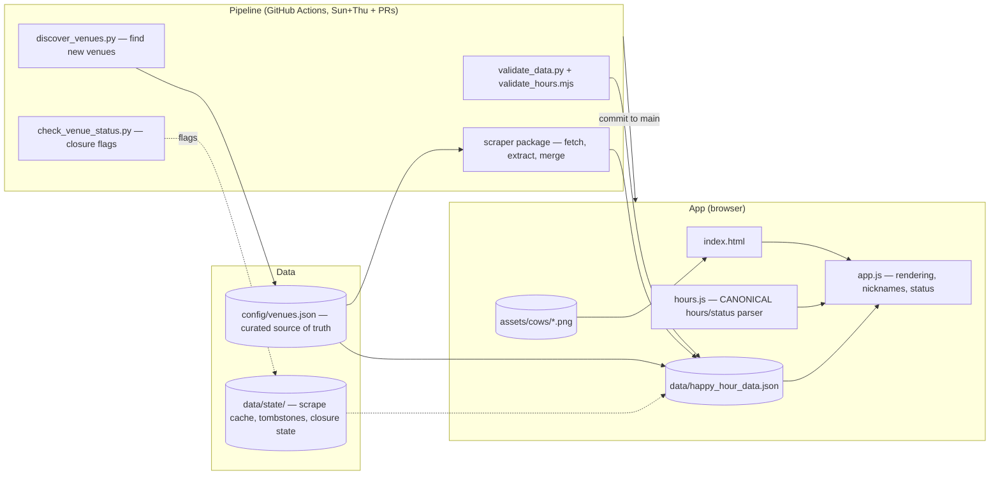

# Happy Cow — Architecture

System overview for the Bozeman happy-hour finder. It shows how the app, the data, and the pipeline fit together, and the invariants that keep the data honest.

- **Repo:** https://github.com/lucas-albers-lz4/happycow (vanilla JS app + static JSON + Python pipeline)
- **Deployment:** GitHub Pages — **auto-redeploys on every commit to `main`**
- **Pipeline mechanics:** see [data-flow.md](data-flow.md) (who writes what, failure semantics)
- **Working on the code:** see [development.md](development.md) (setup, tasks, testing)
- **Refactor history/roadmap:** see [architecture-refactor-plan.md](architecture-refactor-plan.md) (issue #30, all 5 phases done)

## Component map



## The three layers

### 1. App (client-side, no framework)

- `index.html` — single page. It loads `hours.js` **before** `app.js`, because the parser must exist first.
- `app.js` (~1,000 lines) — rendering, search/filter, venue cards, nicknames, the cow bar + horoscope (deliberately whimsical). All injected strings go through `esc()`.
- `hours.js` — the **single source of truth for hours/status math**: `parseHours`, `parseBusinessHours`, `hhStatus(hours, biz, now)`, `timeUntil`. It is pure and unit-tested (19 tests), with an injectable `now`. **Any hours/status change goes here, never back into app.js.** Status badges, live/soon sorting, the "Opens in X" badge, the roulette, and the sad-hour banner all call it.
- Data comes from `data/happy_hour_data.json` — fetched at runtime (network-first via the service worker, so deals never go stale offline).

### 2. Data model

| File | Role |
|---|---|
| `config/venues.json` | **Curated source of truth.** Static fields per venue (id, name, address, tags, noise/mood, nickname + alts, `scrape_urls`) + discovery seeds. Humans curate this. |
| `data/happy_hour_data.json` | **Scraper output / what the app renders.** Adds the runtime fields: `hours`, `business_hours`, `specials[]`, `notes`. Regenerated every scrape. Has the 100%-coverage invariant (below). |
| `data/state/` | Runtime state (atomic writes): scrape cache, tombstones, closure state/report. Public by nature (Pages serves the repo) — hashes/flags only. |

**Venue record** (schema: `schema/venue.schema.json`):

```
id, name, nickname, nickname_alts, address, phone, website, maps,
tags, noise_level, mood,
hours ("Mon-Fri 4-6pm" — full grammar in hours.js: multi-window,
       "close", "all day", midnight crossing),
business_hours, notes, specials[{item, price, category: drinks|food, description}]
```

**Invariants (each one cost a real bug):**

1. **100% coverage** — every venue has `specials` or a known-gap `notes` entry. Enforced by `validate_data.py`.
2. **Carry-through by construction** — `venue_to_site_record()` (scraper/merge.py) starts from ALL config fields (minus pipeline-only keys) and overrides only runtime fields. A new curated field in config survives scrapes automatically.
3. **Source hierarchy** — own-site pages (curated `scrape_urls`) outrank aggregators. The scraper accepts an aggregator page only when it matches the venue (name + street), because mthappyhour pages can leak neighboring venues' data.
4. **Price-0 honesty** — `price: 0` must carry free/discount wording in the description or a venue note. The UI renders discount wording as `—`, not FREE. Enforced by `validate_data.py`.
5. **Hours grammar single-sourced** — `validate_hours.mjs` runs `hours.js` over every hours string in the data (node). The data can never carry a string the parser cannot read.

### 3. Pipeline (Python, run by GitHub Actions)

| Step | Script | Notes |
|---|---|---|
| Discover | `discover_venues.py` | Best-effort. Skips tombstoned venues so closed ones cannot return |
| Scrape | `scripts/scraper/` (`fetch.py` → `extract.py` → `merge.py`, `cli.py` orchestrates) | Own-site first, aggregators last with contamination guard. DeepSeek Flash LLM extraction with pydantic validation + content-hash cache. Previous data kept on failure |
| Closure check | `check_venue_status.py` | Report-only flags (site dead 2× runs, closure wording) → human reviews `data/state/closure_report.md` |
| Validate | `validate_data.py` + `validate_hours.mjs` | **Fails the job before commit** — broken JSON never reaches Pages. Also runs on every PR (`ci.yml`) |
| Remove (manual) | `remove_venue.py <id> --reason "…"` | Sanctioned closure removal: config + data + tombstone |

Shared constants (aggregator hosts, paths, atomic writers) live in `scripts/common.py` — the single source. Edit it there. Never re-define the set elsewhere.

## Key flows

- **Scrape run (Sun + Thu 14:00 UTC):** discover → scrape → closure check → **validate (fail-on-invalid)** → commit → Pages deploys. Manual trigger with `skip_discovery` for fast re-scrapes.
- **PR:** every pull request runs `ci.yml` — validate data + `node --test` — so doc/data/schema regressions are caught before merge.
- **Closure lifecycle:** flag (CI, report-only) → human confirms → `remove_venue.py` (config + data + tombstone) → discovery can never re-add it.
- **New curated field:** add to `config/venues.json` → carry-through handles the rest → validator's config/data parity check confirms it landed.
